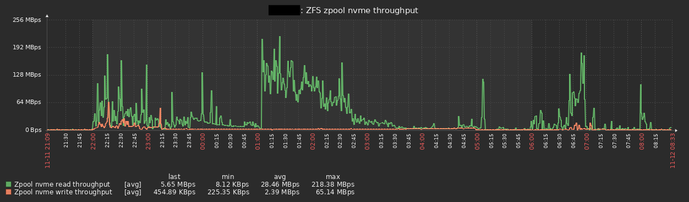
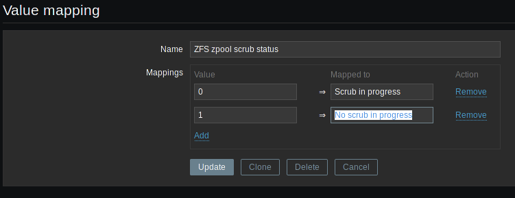
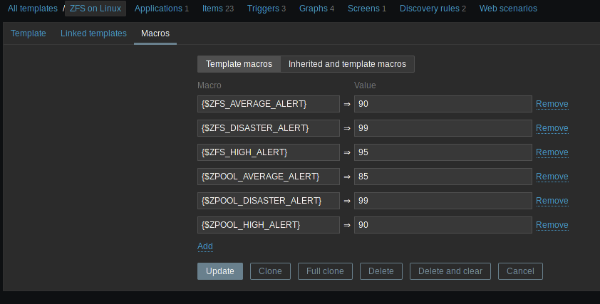
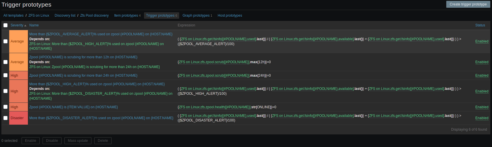

# Monitor ZFS on Linux on Zabbix


**DISCLAMER:** *Here is a fork unless my pool request wasn't approved for the next reasons: https://github.com/Cosium/zabbix_zfs-on-linux/pull/30*


This template is a modified version of the original work done by pbergdolt and posted on the zabbix forum a while ago here: https://www.zabbix.com/forum/zabbix-cookbook/35336-zabbix-zfs-discovery-monitoring?t=43347 . Also the original home of this variant was on https://share.zabbix.com/zfs-on-linux .

I have maintained and modified this template over the years and the different versions of ZoL on a large number of servers so I'm pretty confident that it works ;)

Thanks to external contributors, this template was extended and is now more complete than ever. However, if you find a metric that you need and is missing, don't hesitate to open a ticket or even better, to create a PR!

Tested Zabbix server version include 4.0, 4.4, 5.0 and 5.2 . The template shipped here is in 4.0 format to allow import to all those versions.

This template will give you screens and graphs for memory usage, zpool usage and performance, dataset usage, etc. It includes triggers for low disk space (customizable via Zabbix own macros), disks errors, etc.

Example of graphs:
- Arc memory usage and hit rate:

- Complete breakdown of META and DATA usage:

- Dataset usage, with available space, and breakdown of used space with directly used space, space used by snapshots and space used by children:

- Zpool IO throughput:


# Supported OS and ZoL version
Any Linux variant should work, tested version by myself include:
- Debian 8, 9, 10
- Ubuntu 16.04, 18.04 and 20.04
- CentOS 6 and 7

About the ZoL version, this template is intended to be used by ZoL version 0.7.0 or superior but still works on the 0.6.x branch.

# Installation on Zabbix server

To use this template, follow those steps:

## Create the Value mapping "ZFS zpool scrub status"
Go to:
- Administration
- General
- Value mapping

Then create a new value map named `ZFS zpool scrub status` with the following mappings:

| Value | Mapped to |
| ----- | --------- |
| 0 | Scrub in progress |
| 1 | No scrub in progress |



## Import the template
Import the template that is in the "template" directory of this repository or download it directly with this link: 

# Installation on the server you want to monitor
## Prerequisites
The server needs to have some very basic tools to run the user parameters:
- awk
- cat
- grep
- sed
- tail

Usually, they are already installed and you don't have to install them.
## Add the userparameters file on the servers you want to monitor

There are 2 different userparameters files in the "userparameters" directory of this repository.

One uses sudo to run and thus you must give zabbix the correct rights and the other doesn't use sudo.

On recent ZFS on Linux versions (eg version 0.7.0+), you don't need sudo to run `zpool list` or `zfs list` so just install the file  and you are done.

For older ZFS on Linux versions (eg version 0.6.x), you will need to add some sudo rights with the file . On some distribution, ZoL already includes a file with all the necessary rights at `/etc/sudoers.d/zfs` but its content is commented, just remove the comments and any user will be able to list zfs datasets and pools. For convenience, here is the content of the file commented out:
```
## Allow read-only ZoL commands to be called through sudo
## without a password. Remove the first '#' column to enable.
##
## CAUTION: Any syntax error introduced here will break sudo.
##
## Cmnd alias specification
Cmnd_Alias C_ZFS = \
  /sbin/zfs "", /sbin/zfs help *, \
  /sbin/zfs get, /sbin/zfs get *, \
  /sbin/zfs list, /sbin/zfs list *, \
  /sbin/zpool "", /sbin/zpool help *, \
  /sbin/zpool iostat, /sbin/zpool iostat *, \
  /sbin/zpool list, /sbin/zpool list *, \
  /sbin/zpool status, /sbin/zpool status *, \
  /sbin/zpool upgrade, /sbin/zpool upgrade -v

## allow any user to use basic read-only ZFS commands
ALL ALL = (root) NOPASSWD: C_ZFS
```
If you don't know where your "userparameters" directory is, this is usually the `/etc/zabbix/zabbix_agentd.d` folder. If in doubt, just look at your `zabbix_agentd.conf` file for the line begining by `Include=`, it will show where it is.

## Restart zabbix agent
Once you have added the template, restart zabbix-agent so that it will load the new userparameters.

# Customization of alert level by server
This template includes macros to define when the "low disk spaces" type triggers will fire.

By default, you will find them on the macro page of this template:


If you change them here, they will apply to every hosts linked to this template, which may not be such a good idea. Prefer to change the macros on specific servers if needed.

You can see how the macros are used by looking at the discovery rules, then "Trigger prototypes":


# Important note about Zabbix active items

'zol_template.xml' uses Zabbix items of type `Zabbix agent (active)` (= active items). By default, most template uses `Zabbix agent` items (= passive items).

If you want, you can convert all the items to `Zabbix agent` or import 'zol_template_passive.xml', but you should really uses active items because those are way more scalable. The official documentation doesn't really make this point clear (https://www.zabbix.com/documentation/4.0/manual/appendix/items/activepassive) but active items are optimized: the agent asks the server for the list of items that the server wants, then send them by batch periodically.

On the other hand, for passive items, the zabbix server must establish a connection for each items and ask for them, then wait for the anwser: this results in more CPU, memory and network consumption used by both the server and the agent.

To make an active item work, you must ensure that you have a `ServerActive=your_zabbix_server_fqdn_or_ip` line in your agent config file (usually `/etc/zabbix/zabbix_agentd.conf`).

You also need to configure the "Host Name" on the zabbix UI to be the same as the server output of the `hostname` command (you can always adjust the "Visible name" in the Zabbix UI to anything you want if needed) because the zabbix agent sends this information to the zabbix server. It basically tells the server "Hello, I am $(hostname), which items do you need from me?" so if there is a mismatch here, the server will most likely answer "I don't know you!" ;-)

Beyond a certain point, depending on your hardware, you *will have to use active items*.

An old but still relevant blog about high performance zabbix is available on https://blog.zabbix.com/scalable-zabbix-lessons-on-hitting-9400-nvps/2615/ .
